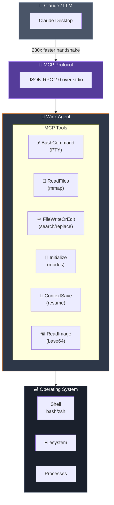
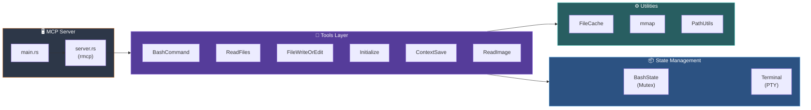

<table style="width:100%" align="center" border="0">
  <tr>
    <td width="40%" align="center"></td>
    <td><h1>✨ Ｗｉｎｘ Ａｇｅｎｔ ✨</h1></td>
  </tr>
</table>

<p align="center">
  <strong>🦀 High-performance Rust implementation of WCGW for code agents 🦀</strong>
</p>

<p align="center">
  
  
  
  
</p>

---

## 🚀 Why Winx?

Winx is a **Rust** reimplementation of [WCGW](https://github.com/rusiaaman/wcgw) (Python), offering drastically superior performance for code operations in LLM agents.

### ⚡ Benchmark: Winx vs WCGW

| Operation | WCGW (Python) | Winx (Rust) | Speedup |
|-----------|---------------|-------------|---------|
| **MCP Init** | 2538ms | 11ms | **230x** |
| Shell Exec | 17.5ms | 0.7ms | **24x** |
| File Read | 7.0ms | 1.0ms | **7x** |
| Pattern Search | 11.9ms | 1.2ms | **10x** |

> **Real MCP Protocol:** 230x faster handshake
> **Overall average:** 8.7x faster on typical operations

---

## 📖 Overview



---

## 🛠️ Quick Installation

### Prerequisites

- Rust 1.75+
- Linux/macOS/WSL2

### Build

```bash
git clone https://github.com/gabrielmaialva33/winx-code-agent.git
cd winx-code-agent
cargo build --release
```

### Configure Claude Desktop

Add to `~/.config/Claude/claude_desktop_config.json`:

```json
{
  "mcpServers": {
    "winx": {
      "command": "/path/to/winx-code-agent/target/release/winx-code-agent",
      "args": [],
      "env": {
        "RUST_LOG": "info"
      }
    }
  }
}
```

---

## 🔧 Available Tools

### `Initialize`

Initialize the workspace environment. **Always call first.**

```json
{
  "type": "first_call",
  "any_workspace_path": "/home/user/project",
  "mode_name": "wcgw"
}
```

**Modes:**
- `wcgw` - Full access (default)
- `architect` - Read-only mode
- `code_writer` - Restricted write access

### `BashCommand`

Execute shell commands with full PTY support.

```json
{
  "action_json": {
    "type": "command",
    "command": "ls -la"
  },
  "thread_id": "abc123"
}
```

**Supported actions:**
- `command` - Execute command
- `status_check` - Check command status
- `send_text` - Send text input
- `send_specials` - Send special keys (Enter, Ctrl-c, etc)
- `send_ascii` - Send ASCII codes

### `ReadFiles`

Read files with line range support.

```json
{
  "file_paths": [
    "/path/to/file.rs",
    "/path/to/other.rs:10-50"
  ]
}
```

### `FileWriteOrEdit`

Write or edit files with SEARCH/REPLACE blocks.

```json
{
  "file_path": "/path/to/file.rs",
  "percentage_to_change": 30,
  "text_or_search_replace_blocks": "<<<<<<< SEARCH\nold code\n=======\nnew code\n>>>>>>> REPLACE",
  "thread_id": "abc123"
}
```

### `ContextSave`

Save project context for later resumption.

```json
{
  "id": "my-task",
  "project_root_path": "/home/user/project",
  "description": "Implementing feature X",
  "relevant_file_globs": ["src/**/*.rs", "Cargo.toml"]
}
```

### `ReadImage`

Read images and return as base64.

```json
{
  "file_path": "/path/to/image.png"
}
```

---

## 🏗️ Architecture



### Project Structure

```
src/
├── main.rs              # Entry point
├── server.rs            # MCP server (rmcp)
├── lib.rs               # Library exports
├── types.rs             # Types and schemas
├── errors.rs            # Error handling
├── tools/
│   ├── mod.rs           # Tool registry
│   ├── bash_command.rs  # Shell execution (PTY)
│   ├── read_files.rs    # File reading (mmap)
│   ├── file_write.rs    # File writing
│   ├── initialize.rs    # Mode initialization
│   ├── context_save.rs  # Context persistence
│   └── read_image.rs    # Image processing
├── state/
│   ├── mod.rs           # State management
│   ├── bash_state.rs    # Shell state (Mutex)
│   └── terminal.rs      # Terminal handling
└── utils/
    ├── file_cache.rs    # File caching
    ├── mmap.rs          # Memory-mapped I/O
    ├── path.rs          # Path utilities
    └── repo.rs          # Repository analysis
```

### Core Technologies

| Component | Technology | Why |
|-----------|------------|-----|
| Runtime | Tokio | High-performance async I/O |
| MCP | rmcp | Official Rust SDK for MCP |
| Shell | portable-pty | Cross-platform PTY |
| Files | memmap2 | Zero-copy file reading |
| Concurrency | tokio::sync::Mutex | Thread-safe state |
| Matching | rayon | Parallel fuzzy matching |

---

## 🧪 Tests

```bash
# Run all tests
cargo test

# Tests with output
cargo test -- --nocapture

# Specific tests
cargo test bash_command
cargo test file_write
```

**Status:** 118 tests passing (90 unit + 28 integration)

---

## 📊 Performance Details

### Why is Rust faster?

1. **Shell Exec (24x)**
   - Python: subprocess fork + interpreter overhead
   - Rust: direct syscall via PTY

2. **File Read (7x)**
   - Python: object allocation + GIL
   - Rust: mmap zero-copy

3. **MCP Protocol (230x)**
   - Python: slow JSON parsing + startup time
   - Rust: serde + instant startup

### When to use each?

| Scenario | Recommendation |
|----------|----------------|
| Hot paths (autocomplete) | **Winx** |
| Light commands (ls, cat) | **Winx** |
| Heavy commands (build) | Either works |
| Debug/compatibility | WCGW |

---

## 🔀 Comparison with WCGW

| Feature | WCGW (Python) | Winx (Rust) |
|---------|---------------|-------------|
| Language | Python 3.10+ | Rust 1.75+ |
| Performance | Baseline | **2-230x faster** |
| Memory | ~50MB | ~5MB |
| PTY Support | ✅ | ✅ |
| MCP Protocol | ✅ | ✅ |
| Search/Replace | ✅ | ✅ |
| Context Save | ✅ | ✅ |
| AI Integration | ❌ | ✅ (NVIDIA NIM) |
| Parallel Matching | ❌ | ✅ (rayon) |
| Memory-mapped I/O | ❌ | ✅ (memmap2) |

---

## 🤖 AI Integration (Optional)

Winx supports AI provider integration for code analysis:

```bash
# DashScope (Qwen3)
export DASHSCOPE_API_KEY="your-key"

# NVIDIA NIM
export NVIDIA_API_KEY="your-key"

# Google Gemini
export GEMINI_API_KEY="your-key"
```

**AI Tools:**
- `code_analyzer` - Bug/security analysis
- `ai_generate_code` - Code generation
- `ai_explain_code` - Code explanation
- `winx_chat` - Assistant chat

---

## 📝 Changelog

### v0.2.1 (Current)
- ✅ 1:1 parity with WCGW Python
- ✅ 118 tests passing
- ✅ SpecialKey serialization fixed
- ✅ Mutex safe error handling
- ✅ Race condition fix with tokio::sync::Mutex

### v0.2.0
- Core port of wcgw Python to Rust
- 6 MCP tools implemented
- 3 operational modes

### v0.1.5
- Multi-provider AI integration
- DashScope, NVIDIA NIM, Gemini

---

## 🙏 Credits

- [rusiaaman/wcgw](https://github.com/rusiaaman/wcgw) - Original Python project
- [anthropics/claude-code](https://github.com/anthropics/claude-code) - MCP inspiration
- [modelcontextprotocol](https://github.com/modelcontextprotocol) - MCP specification

---

## 📜 License

MIT - Gabriel Maia ([@gabrielmaialva33](https://github.com/gabrielmaialva33))

---

<p align="center">
  <strong>✨ Made with 🦀 Rust and ❤️ by Gabriel Maia ✨</strong>
</p>
