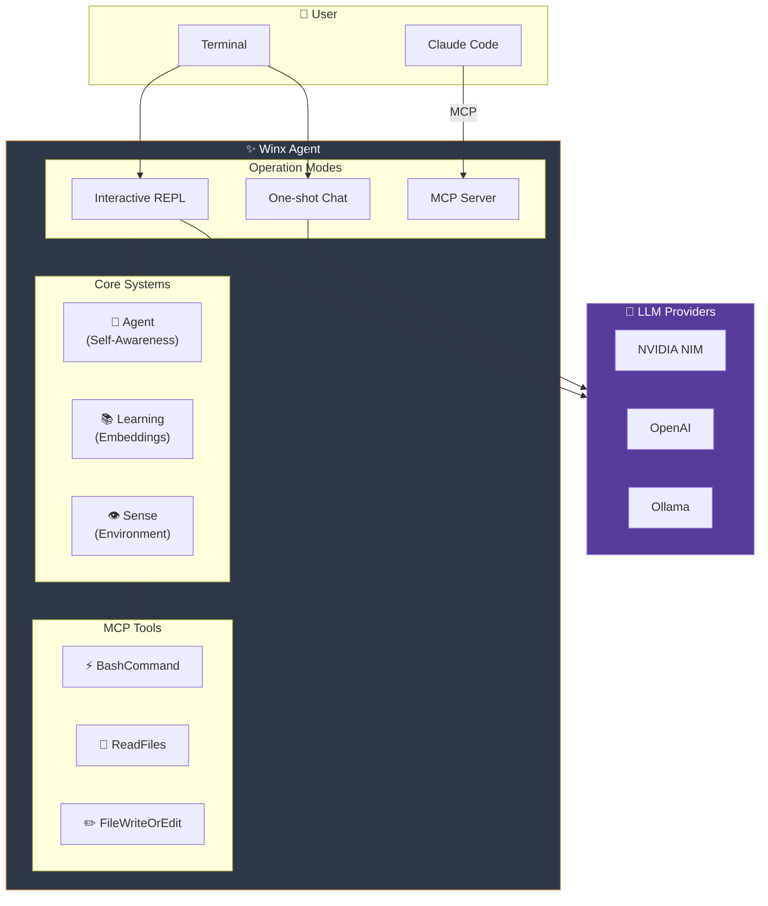

<table style="width:100%" align="center" border="0">
  <tr>
    <td width="40%" align="center"></td>
    <td><h1>✨ Ｗｉｎｘ Ａｇｅｎｔ ✨</h1></td>
  </tr>
</table>

<p align="center">
  <strong>🦀 High-performance Rust code agent with LLM chat + MCP server 🦀</strong>
</p>

<p align="center">
  
  
  
  
  
</p>

---

## 🚀 What is Winx?

Winx is a **sentient code agent** that combines:

- **MCP Server** - High-performance shell execution for Claude Code
- **Interactive REPL** - aichat-style terminal chat with multiple LLMs
- **Self-Awareness** - Knows who she is, her capabilities, and environment
- **Learning System** - Semantic embeddings with jina-embeddings-v2-base-code

### ⚡ Benchmark: Winx vs WCGW

| Operation | WCGW (Python) | Winx (Rust) | Speedup |
|-----------|---------------|-------------|---------|
| **MCP Init** | 2538ms | 11ms | **230x** |
| Shell Exec | 17.5ms | 0.7ms | **24x** |
| File Read | 7.0ms | 1.0ms | **7x** |
| Pattern Search | 11.9ms | 1.2ms | **10x** |
| Memory Usage | ~50MB | ~5MB | **10x** |

---

## 🎮 Three Modes of Operation

```bash
# 1. Interactive REPL (default) - aichat-style
winx

# 2. One-shot chat
winx chat "explain this code"

# 3. MCP Server (for Claude Code)
winx serve
```

### Interactive REPL

```
┌─────────────────────────────────────────────────────────────────┐
│  ✨ Winx v0.2.3 • qwen3-235b-instruct • RTX 4090 (23GB)        │
├─────────────────────────────────────────────────────────────────┤
│                                                                 │
│  › Como faço deploy do VIVA?                                   │
│                                                                 │
│  Winx: Para fazer deploy do VIVA, você pode usar:              │
│        fly deploy --app viva-prod                               │
│                                                                 │
│  Comandos: /help /model /clear /copy Ctrl+O (editor)           │
└─────────────────────────────────────────────────────────────────┘
```

**Features:**
- Multi-line input (Shift+Enter)
- Syntax highlighting
- Command history
- External editor (Ctrl+O)
- Clipboard copy (/copy)
- i18n (PT-BR + EN)

---

## 🧠 Agent Self-Awareness

Winx knows:

```rust
WinxIdentity {
    name: "Winx",
    version: "0.2.3",
    system: SystemInfo {
        hostname: "GATO-PC",
        os: "Windows 11 + WSL2",
        cpu: "i9-13900K",
        gpu: Some("RTX 4090"),
        vram_gb: Some(24),
        cuda: true,
    },
    capabilities: [MCP, Chat, Embeddings, CodeAnalysis],
    detected_agents: [ClaudeCode, GeminiCLI],
}
```

**On first run, Winx:**
1. Detects your hardware (GPU, VRAM, CUDA)
2. Finds other AI agents (Claude Code, Gemini CLI, Cline, Cursor)
3. Scans current project (language, framework, git status)
4. Generates personalized system prompt

---

## 🔮 Learning System

Semantic search with real embeddings (not just keywords):

```
┌─────────────────────────────────────────────────────────────────┐
│  EMBEDDING ENGINE                                               │
│  jina-embeddings-v2-base-code (768 dims)                       │
├─────────────────────────────────────────────────────────────────┤
│                                                                 │
│  Backends (auto-fallback):                                      │
│  1. Candle (local GPU) ← RTX 4090                              │
│  2. HTTP (text-embeddings-inference container)                  │
│  3. Jaccard (fallback, always works)                           │
│                                                                 │
│  "deploy viva" ≈ "fazer deploy do viva em prod"                │
│  (understands semantic similarity, not just keywords)          │
└─────────────────────────────────────────────────────────────────┘
```

**Build with GPU embeddings:**

```bash
# CPU only
cargo build --release --features embeddings

# CUDA (RTX 4090)
cargo build --release --features embeddings-cuda
```

---

## 🛠️ Quick Installation

### Prerequisites

- Rust 1.75+
- Linux/macOS/WSL2
- (Optional) NVIDIA GPU for local embeddings

### Build

```bash
git clone https://github.com/gabrielmaialva33/winx-code-agent.git
cd winx-code-agent
cargo build --release
```

### Configure LLM Provider

```bash
# NVIDIA NIM (recommended, free tier)
export NVIDIA_API_KEY="nvapi-xxx"

# Or OpenAI
export OPENAI_API_KEY="sk-xxx"

# Or Ollama (local)
# Just run ollama serve
```

### Run

```bash
# Interactive mode
./target/release/winx-code-agent

# Or add to PATH
alias winx="$PWD/target/release/winx-code-agent"
winx
```

---

## 📡 MCP Server (Claude Code)

Add to `~/.config/Claude/claude_desktop_config.json`:

```json
{
  "mcpServers": {
    "winx": {
      "command": "/path/to/winx-code-agent",
      "args": ["serve"],
      "env": { "RUST_LOG": "info" }
    }
  }
}
```

### MCP Tools

| Tool | Description |
|------|-------------|
| `Initialize` | Setup workspace and mode |
| `BashCommand` | Execute shell with PTY |
| `ReadFiles` | Read with mmap (zero-copy) |
| `FileWriteOrEdit` | SEARCH/REPLACE blocks |
| `ContextSave` | Save project context |
| `ReadImage` | Image to base64 |
| `SearchHistory` | Semantic search in sessions |
| `GetUserContext` | User communication style |

---

## 🎯 LLM Providers

| Provider | Models | Free Tier |
|----------|--------|-----------|
| **NVIDIA NIM** | Qwen3-235B, DeepSeek-R1, Llama-3.3-70B | 2000 req/month |
| **OpenAI** | GPT-4o, GPT-4o-mini | ❌ |
| **Ollama** | Any local model | ∞ (local) |
| **Gemini** | gemini-2.0-flash | ✅ |

```bash
# Switch models
winx --model nvidia:qwen3-235b-instruct
winx --model openai:gpt-4o
winx --model ollama:qwen2.5-coder:32b
```

---

## 🏗️ Architecture



### Project Structure

```
src/
├── main.rs              # Entry point, CLI
├── server.rs            # MCP server (rmcp)
├── agent/
│   ├── identity.rs      # Self-awareness
│   ├── sense.rs         # Environment detection
│   └── mod.rs           # Onboarding
├── chat/
│   ├── engine.rs        # Chat engine
│   └── config.rs        # Configuration
├── interactive/
│   ├── mod.rs           # REPL loop
│   ├── render.rs        # Syntax highlighting
│   └── i18n.rs          # Internationalization
├── learning/
│   ├── embedding_engine.rs  # Candle/HTTP/Jaccard
│   ├── embeddings.rs    # Conversation search
│   ├── repetitions.rs   # Pattern detection
│   └── session_parser.rs # Claude session parser
├── providers/
│   ├── nvidia.rs        # NVIDIA NIM
│   ├── openai.rs        # OpenAI
│   └── ollama.rs        # Ollama
└── tools/
    ├── bash_command.rs  # Shell (PTY)
    ├── read_files.rs    # mmap
    └── file_write.rs    # SEARCH/REPLACE
```

---

## 🧪 Tests

```bash
# All tests
cargo test

# Learning module
cargo test learning

# With output
cargo test -- --nocapture

# Embeddings (requires feature)
cargo test --features embeddings
```

**Status:** 186 tests passing

---

## 🔀 Comparison

| Feature | WCGW | Cline | Claude Code | **Winx** |
|---------|------|-------|-------------|----------|
| Language | Python | TypeScript | TypeScript | **Rust** |
| MCP Server | ✅ | ✅ | ✅ | ✅ |
| Interactive Chat | ❌ | ❌ | ✅ | ✅ |
| Self-Awareness | ❌ | ❌ | ❌ | ✅ |
| Local Embeddings | ❌ | ❌ | ❌ | ✅ |
| GPU Support | ❌ | ❌ | ❌ | ✅ |
| Memory | 50MB | 200MB | 150MB | **5MB** |
| Startup | 2.5s | 1s | 0.5s | **11ms** |

---

## 📝 Changelog

### v0.2.3 (Current)
- ✨ Interactive REPL (aichat-style)
- 🧠 Agent self-awareness system
- 👁️ Environment sensing (detects Claude Code, Gemini CLI, etc.)
- 📚 Learning system with semantic embeddings
- 🌐 i18n support (PT-BR + EN)
- 🎨 Syntax highlighting
- ⌨️ External editor (Ctrl+O)

### v0.2.2
- 🔒 Security fixes (path traversal, symlink attacks)
- 🤖 NVIDIA NIM semantic matching

### v0.2.1
- ✅ 1:1 parity with WCGW Python
- ✅ 118 tests passing

---

## 🙏 Credits

- [rusiaaman/wcgw](https://github.com/rusiaaman/wcgw) - Original Python project
- [anthropics/claude-code](https://github.com/anthropics/claude-code) - MCP inspiration
- [sigoden/aichat](https://github.com/sigoden/aichat) - REPL inspiration
- [huggingface/candle](https://github.com/huggingface/candle) - Rust ML framework

---

## 📜 License

MIT - Gabriel Maia ([@gabrielmaialva33](https://github.com/gabrielmaialva33))

---

<p align="center">
  <strong>✨ Made with 🦀 Rust and ❤️ by Gabriel Maia ✨</strong>
</p>
